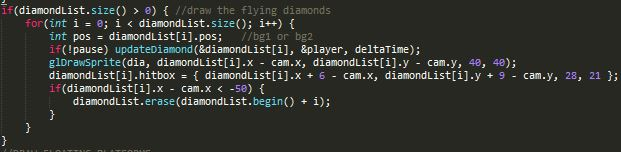
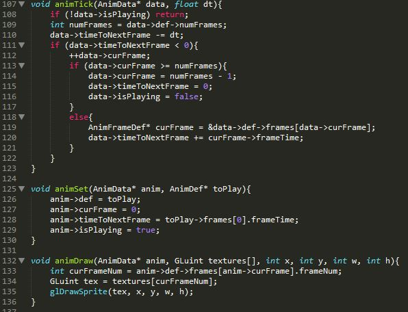
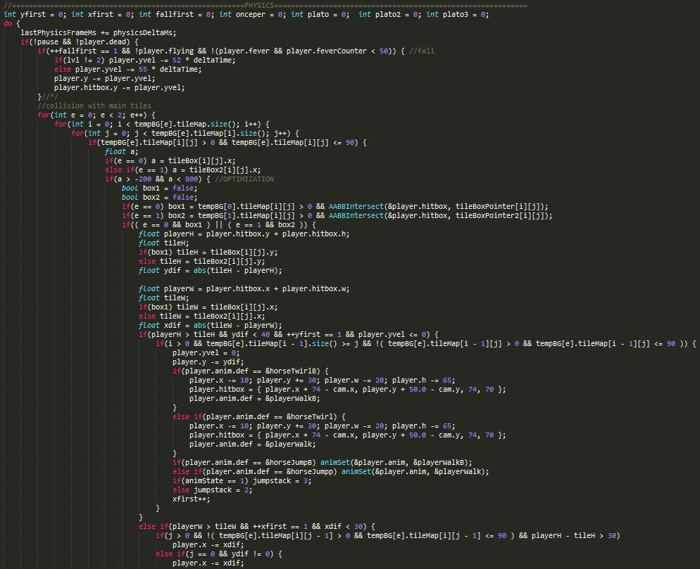
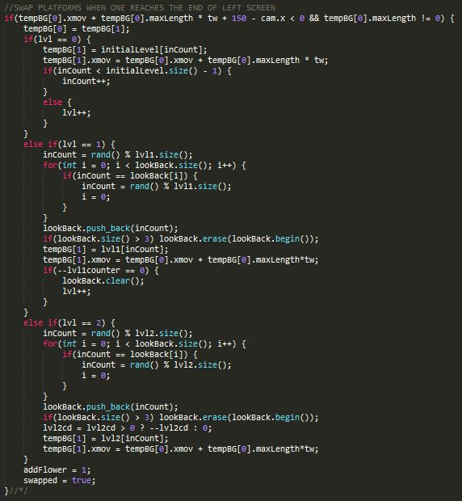
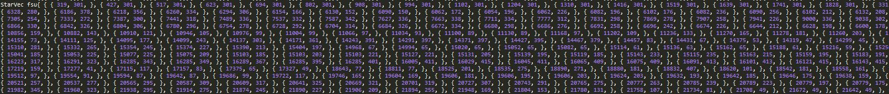
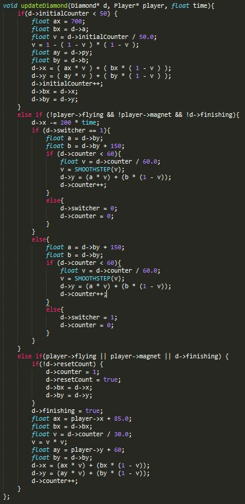

#The Dark Horse Rises

##Synopsis
The Dark Horse Rises was a game made over a span of a little over a month that I made using C++, SDL, and OpenGL in Visual Studio. It was a project I was very passionate about and still is my favorite project I have worked on so far. It got me passionate about programming and about game development. I wanted to make a game that was simple yet fun while feeling like a full game instead of a demo. Here I will go through the steps I took to make the game as well as explain parts of the code and the challenges and obstacles that I ran into while coding. 

##Building a Game Engine
Building a game from scratch was initially more challenging than I thought it would be. I wasn't sure how to make hard boundaries using coordinates, add a moving background with parallax, or even move the character around with the arrow keys in a smooth way. I started with the basics. First, make a platform where the player can walk on. Next, add multiple tiles so he can walk accross the map. Next, figure out a way to implement gravity. Then after that we need collision, collision detection for jumping, moving, staying still, etc. After that animation becomes important. You need different animations for every move, and it must react along with the position of the character with every input. The character should be able to traverse any terrain that the tile-based map can throw at it, whether it's collision from the bottom, side, or top. Hitboxes need to be implemented for different scenarios and have to match with the animation frame. Finally, different kinds of physics have to be implemented: jumping off of things, falling, getting hit, double jumping, triple jumping, gliding, etc. These were the basics of the game engine, but even they brought many unforseen and frustrating challenges.

_The premise of the game: A horse leaves his owner to find out who he truly is. (Also, notice the flowers, they bloom when he runs by them)_

##The Game, its Implementation, and the Challenges.
One thing that this game taught me about programming is that nothing really goes according to plan. I would say oh, that seems easy to implement, and it would end up taking me 3 days of coding and debugging. Here I'll try to concisely describe some key features and how I implemented them along with the challenges I ran into along the way.

###Animation
The animation is handled by 3 structs (AnimFrameDef, AnimDef, and AnimData) and 3 functions (animTick, animSet, and animDraw). The structs define the necessary variables. AnimFrameDef holds the number of the frame and how long it stays on the screen. AnimDef defines an AnimFrameDef and also how many frames there are total in the animation. AnimData defines a pointer to AnimDef and defines the current frame, time to the next frame, and a boolean to set the animation to run or not. The functions run the animation, with animTick using the data to go to the next frame if conditions are met, animSet being used to set an animation to a certain state and frame, and animDraw to draw the character on the screen.

One challenge was playing the right animation when the horse (main character) changes states. Since there were so many animations and so many states, it became tough to keep track of them all each time an animation change happened. 

###Physics/Collision
Physics and collision gave me the most bugs and challenges of the entire project. Even simple things created some strange bugs that took me several days to fix. At the beginning, a problem was the character not going past one block horizontally, because I had set the condition to 'when you touch a block, stop moving' to enforce gravity. To fix this, I moved the checking of whether the character was touching the ground to the physics loop, simply un-applying gravity when the horse touched the ground. Another small, related challenge was that when I did that, the character would be stuck under the platform if it was going fast enough downwards. I fixed this by moving it back up the amount it needed in order to be on the top most tile. Then, the horse could be seen going under the platform for a split second before jumping back up. To fix this, I moved the drawing functions after the physics loop. Other physics related challenges were hitting a tile at an angle while coming down from a jump, jittering (small, rapid up and down movements while standing on a platform), only detecting collision for the top tile and no other tile, colliding into multiple enemies at the same time, and many more. There were many other small, hard to fix bugs that I ran into with physics, and I eventually fixed them through debugging, memory breakpoints, print statements, or creating smaller simulations of parts of the code in another project. 

_The first part of the physics loop that covers gravity, the physics timer, and collision with the main tiles. tempBG is the 2 map buffer. tileMap is the 2d array holding the map. The boxes are hitboxes for each tile. 'player.y-=ydif' is where the player is kept from going into the tiles._

###Endless platforms
I was initially stumped on how to make endless platforms that constantly kept generating and how I would manage all those maps at once. I fixed this by creating a two map buffer, where two out of several maps would be randomly stored in a buffer, and because the maps are so big you only see one and switch every 20 seconds or so. The buffer allows maps to constantly be fed into the right side of the screen. This allowed for one layer of optimization, where you don't ever need to draw more than two maps. Another layer of optimization was only drawing the tiles that were on the map. These two considerations made the game run much smoother and better. 

_This is the part of code that advances the buffer and adds a new map. Because there are 3 levels, it adds a different pool of random maps depending on the levels. Here, tempBG is the buffer (it holds 2 maps). At the beginning, I shift the buffer over 1 since tempBG[0] has already gone off the left side of the screen. Then I add a new map from the appropriate random list of maps (depending on the level). _

###Stars
One challenge was adding stars in the special stage. The special stage is an all the stars you can get type of level where there are no enemies and you just jump around and get all the stars you can get. However, because the level was so large, placing the stars one by one through coordinates would have taken much too long. After some struggle, I decded to implement a system where I could go into the game stage, click on where I wanted the stars, have temporary stars show up to show me what they would look like, and have all the coordinates be written to a text file and read into the code as a list of an object I called StarVec. These hold stars that can be picked up when touched and add to your gold count. This made it much faster to organize the stars and put in any pattern I wanted. I also added an undo functionality to speed up the process (I wouldn't have to restart when I made a mistake). 

_This is just one of the star maps. This one continues for much longer to the right. As you can see, it would have been impossible to do manually._

###Platforms 
I used the same method as the stars to later on make platforms. These platforms didn't conform to the tile spaces (each map is a 2d Array), which created some problems, but with this method, I could place the platform anywhere I wanted and at any height relative to each other, so I could create a gentler or steeper slope. Because my mouse wasn't too accurate, I also made it so that when I was building these platforms, each tile would snap to a nearby tile horizontally if it was close enough, and you could make fine adjustments with your mouse. This, like the stars, allowed me to make many interesting platforms above the tile map that led to some interesting map layouts.

###Diamonds

The diamonds pop out of the mushrooms when the character jumps on them. They go to the right side of the screen and then slowly move up and down to the left. At first I thought I could just set upper and lower bounds and move it left, but the movement was incredibly robotic. I fixed this by creating a function that would move the diamonds in a parabolic motion to the left so that the motion would be much more fluid. I also ran other animations through this function to make the movement much more fluid: the powerups, coins going up to the counter when they've been picked up, the "speed up" sign coming down from the right side of the screen and then pausing in mid screen and then going off to the left, and the trajectory of stars and diamonds as they are sucked into the character when he has the magnet powerup.

_This is the part that makes the diamonds fly out to the right and then move up and down in a parabolic motion to the left. diamondList is the list of diamonds on the map, updateDiamond is the function handling the movement, and I'm erasing them if they reach the left side of the screen. Below is the updateDiamond function._

###Slopes
One last thing I wanted to do was have platforms that went up and down, not just straight. I wanted platforms that were angled, hills, and unique setups with  multiple platforms. This was implemented with the platforms mentioned previously, but getting the physics right was challenging. I tried to fix this by raising the player up to the hypotenuse of the block it is on and the next block. That way if the character is going up a slope, even though the slope is not smooth visually, the character's movements are smooth. I had some more trouble with going downhill, as the gravity and the measurements to have the horse stay on the hypotenuse conflicted with each other.

_This is the first part of the section of code that handles the slopes. I ran into some troubles with the first and last tiles of each section of floating platforms, so that's why the code's a little long. It would also sometimes just go through the tiles if the difference between a tile to the next one was too large. For the uphill, this was fixed by modifying the equation. As you can see, here, I calculate the hypotenuse with the four variables at the top and then use them to set the player's location._

###Others (Organization of code, optimization, framerates, etc)
Optimization came mostly in the form of cleaning up code, creating functions to handle repeated code, and making sure the game didn't have to draw any more than it had to, implemented via boundaries and buckets. A strange problem I had was that on different monitors the game would run at different speeds. I later figured out that it was because of the screen's v-sync option on some computers. I normalized this by changing all the instances of movement inside the game to a function of deltaTime, which would be the time between the 'ticks'. 

##Notes and future changes
When I was finishing up this game, I wanted to get to 2D lighting, but I didn't have the chance to get to it. If I have the time, I plan on trying to implement that. Also, Because of the way I created the executable file for this project at the time, you unfortunately need Visual Studio 2013 to run the game. This is something I will be coming back to and changing in the future.